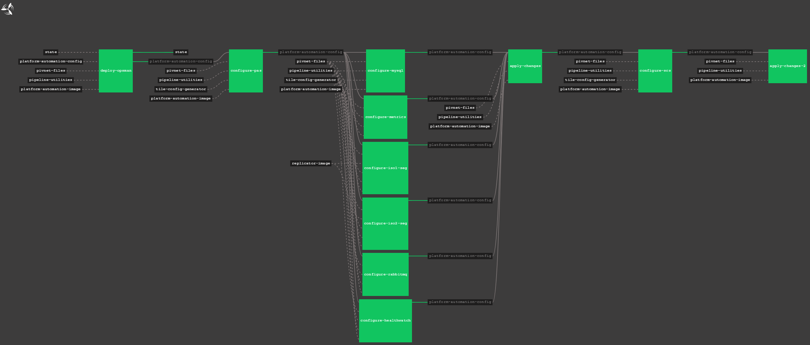

# PCF Automation Example (vSphere)

PCF Automation Example for vSphere

## Getting Started

Platform Automation for PCF is a collection of tools and documentation. It’s not a simple solution that can be “installed.” It is intended to facilitate operator-owned automation of both common and advanced workflows around Pivotal Ops Manager. Ultimately, the resulting automation is a product of the operator.  

Report all bugs to [mariah.jenkins@altoros.com](mailto:mariah.jenkins@altoros.com) or make a pull-request.

### Prerequisites

* A deployed and working instance of Concourse
* Access to Platform Automation on Pivnet

### Initial Download and Setup

The Platform Automation for PCF page on Pivnet has two files you’ll need to download for reference:  

1. Concourse Tasks, a zip file containing Platform Automation for PCF’s concourse tasks.  
2. Docker Image for Concourse Tasks, a tgz file containing the rootfs of the docker image that the automation will use.
    - You will no longer need to build this docker image, as it can be pulled from [Pivotal's Docker Repo](https://hub.docker.com/r/pivotalservices/platform-automation/)


## Implementation
1. There are some vars in this pipeline that will be pulled from Credhub:
    - Pivnet Token
    - Git Private Key
    - vCenter Password
    - Opsman Password
    - Wildcard Certs & Private Keys
2. Any of the above vars can be hardcoded in if you choose not to deploy Credhub with your Concourse instance (not recommended)
3. You will need check in all of your vars files into a system such as Github, Gitlab, or Bitbucket. The automation will reference your var files from your repository


### Usage 
```
fly -t concourse set-pipeline -p install-pcf -c vsphere-pas-pipeline.yml -l environments/nonprod/pipeline-params.yml
```

### Screenshot of Pipeline Preview (Atom)



## Authors

* **Mariah Jenkins** - *Initial work* - [Github](https://github.com/marijenk)

## Links
* [Platform Automation for PCF (Alpha)](https://docs.pivotal.io/pcf-automation/alpha/index.html)

## Acknowledgments

* Pivotal
